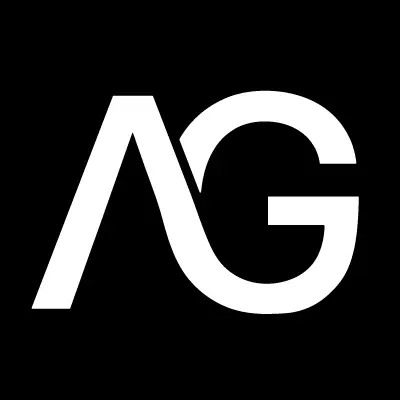

# 🚀 Portfolio Fullstack en Devenir — Anthony Gargoua

<p align="center">
  
  <br>
  <em>"De commercial à Développeur Full Stack"</em>
</p>

<p align="center">
  
  
  
</p>

---

## 📖 Présentation du Projet

Ce dépôt contient le code source de mon portfolio professionnel, conçu comme une application vitrine évolutive. Plus qu'un simple CV, c'est un laboratoire où j'expérimente les dernières technologies **Front-end** et **Back-end**.

📍 **Accès direct :** https://ag-developer-five.vercel.app/
📄 **CV en ligne :** [files/CV_Anthony_GARGOUA_2026.pdf](files/CV_Anthony_GARGOUA_2026.pdf)
🔗 **LinkedIn :** [anthony-gargoua](https://www.linkedin.com/in/anthony-gargoua-776571196/) · **GitHub :** [AnthonyGargoua](https://github.com/AnthonyGargoua)

### 🎯 Objectifs
- **Exposer** mes réalisations en Design et Développement Web.
- **Démontrer** ma capacité à créer des interfaces fluides (UX) et performantes.
- **Cartographier** ma progression technique, notamment durant mon cursus chez **Diginamic**.

---

## 🛠 Stack Technique & Écosystème

La page [`competences.html`](competences.html) reflète en temps réel les compétences listées sur mon CV — organisées par catégorie.

### Front-End
HTML5 · CSS3 · JavaScript · Tailwind CSS

### Back-End
Java · PHP · Node.js · Express

### Base de données
MySQL · PhpMyAdmin · DBeaver · Supabase

### Outils & méthodes
Draw.io · Visual Paradigm · Agile · UML · Git · GitHub · Figma · Suite Adobe

### CMS & Web
WordPress · PrestaShop · WooCommerce

### À venir — Cursus Diginamic (2026)
TypeScript · React · Next.js · Spring · Angular · PostgreSQL · NoSQL (MongoDB/Redis) · Docker · Tests Unitaires (JUnit/Jest) · Architecture Cloud & API REST

---

## ✨ Fonctionnalités Avancées

| Fonctionnalité | Description |
| :--- | :--- |
| **Theme Engine** | Thème sombre par défaut avec halo lumineux vert, bascule vers un thème clair avec persistance locale. |
| **GSAP Timeline** | Séquençage d'apparition des éléments (`fade-in`, `stagger`) pour éviter les effets de flash. |
| **Icônes de compétences** | Chaque techno est représentée par son vrai logo (icônes de marque officielles + Font Awesome pour le reste) plutôt qu'une jauge de niveau — facile à étendre au fil de mes apprentissages. |
| **CV téléchargeable** | Bouton direct dans le header sur toutes les pages, vers le CV à jour au format PDF. |
| **Menu mobile animé** | Le burger se transforme en croix (✕) à l'ouverture pour un retour visuel clair. |
| **Retour en haut** | Bouton flottant qui apparaît au scroll et ramène en douceur en haut de page. |
| **Responsive 2.0** | Grilles adaptatives fluides utilisant les `CSS Variables` pour une maintenance simplifiée. |

---

## 📁 Architecture du Projet

```text
├── files/
│   └── CV_Anthony_GARGOUA_2026.pdf   # CV téléchargeable depuis le header
├── img/                               # Assets visuels et captures d'écran
│   └── icons/                         # Vrais logos de marque (SVG) des technos
├── js/
│   └── script.js                     # Logique d'animation GSAP et gestion du thème
├── styles/
│   └── style.css                     # Système de design global (CSS Variables)
├── index.html                         # Page d'accueil (Hero & Bio)
├── presentation.html                  # Qui suis-je & centres d'intérêt
├── competences.html                   # Stack technique, à jour avec mon CV
├── projets.html                       # Galerie des réalisations
└── contact.html                       # Formulaire de contact optimisé
```
